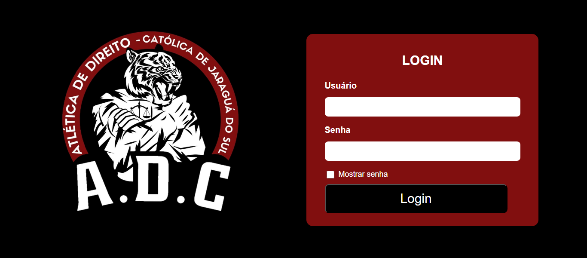

# Gerenciador de Estoque e Membros

## Descrição

Este é um sistema web para gerenciar o controle de membros e de estoque de uma entidade sem fins lucrativos. O objetivo do projeto é auxiliar a **Atlética de Direito da Católica de Jaraguá do Sul (ADC)** no gerenciamento de seus membros e no controle de itens em estoque, permitindo o cadastro, consulta e modificação das informações dos membros, além do controle de produtos com preços e quantidade disponível.

O projeto foi desenvolvido como parte de um trabalho acadêmico, e visa ajudar a entidade com o gerenciamento de suas atividades diárias de forma simples e eficiente.

## Tecnologias Utilizadas

O sistema foi desenvolvido utilizando as seguintes tecnologias:

- **Python** (Back-end)
- **Flask** (Framework Web)
- **SQLAlchemy** (ORM para banco de dados)
- **HTML** (Estrutura de páginas)
- **CSS** (Estilos e layout)
- **JavaScript** (Interatividade)

## Instalação

Para rodar o projeto localmente, siga os seguintes passos:

### Pré-requisitos

- **Python 3.8+** instalado no sistema
- **pip** (gerenciador de pacotes do Python)
- **Virtualenv** (opcional, para criar um ambiente virtual isolado)

### Passo a Passo

1. Clone o repositório:
   ```bash
   git clone https://github.com/seu-usuario/seu-repositorio.git
   ```

2. Acesse o diretório do projeto:
   ```bash
   cd seu-repositorio
   ```

3. (Opcional) Crie e ative um ambiente virtual:
   ```bash
   python -m venv venv
   source venv/bin/activate  # No Windows, use: venv\Scripts\activate
   ```

4. Instale as dependências:
   ```bash
   pip install -r requirements.txt
   ```

5. Execute o servidor Flask:
   ```bash
   flask run
   ```

6. Acesse a aplicação em `http://localhost:5000` no seu navegador.

## Funcionalidades

- **Login:** Sistema de autenticação para acessar o painel administrativo.
- **Cadastro de Membros:** Adicione, edite e remova membros com informações pessoais, como nome, data de nascimento, e-mail, etc.
- **Gerenciamento de Estoque:** Controle de produtos disponíveis, com a opção de cadastrar, editar e remover itens, além de gerenciar a quantidade disponível e o preço de cada item.
- **Interface Intuitiva:** O sistema oferece uma interface simples e amigável para facilitar o gerenciamento de membros e produtos.

## **Paleta de Cores**
A paleta de cores utilizada no projeto foi composta pelos seguintes tons:

-  `#000000`: Preto, utilizado em textos e elementos.
-  `#FFFFFF`: Branco, utilizado no fundo das páginas e elementos.
-  `#810F0F`: Vermelho Escuro, utilizado em destaque na barra superior (AppBar) e botões.
-  `#333333`: Cinza Escuro, utilizado em fundos e elementos secundários.

---

## **Prints de Telas**
Aqui estão alguns prints das telas do aplicativo:

### **Tela de Login**


### **Tela de Cadastro de Membros**


### **Popup de Edição/Cadastro de Membro**


### **Controle de Estoque**


### **Popup de Cadastro de Produto**


---

## Autor

- **Kevin Chedid El Azar**

## Licença

Este projeto está licenciado sob a [MIT License](./LICENSE).

---